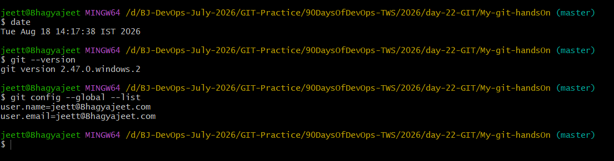
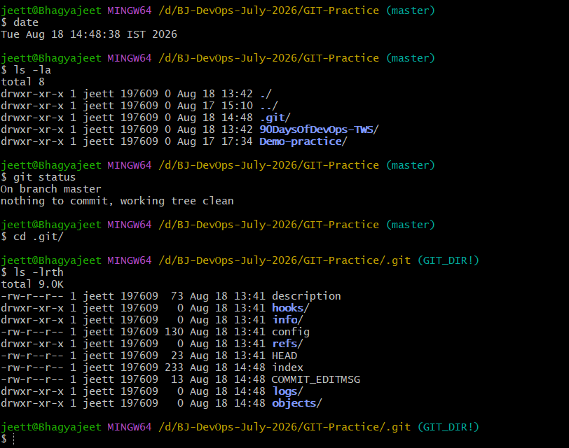
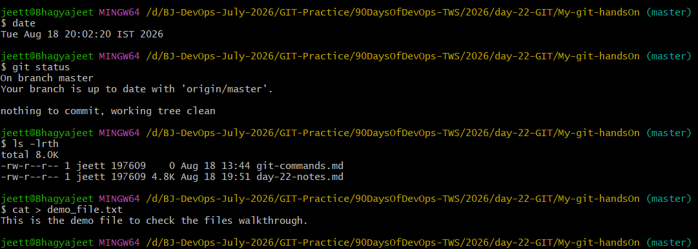
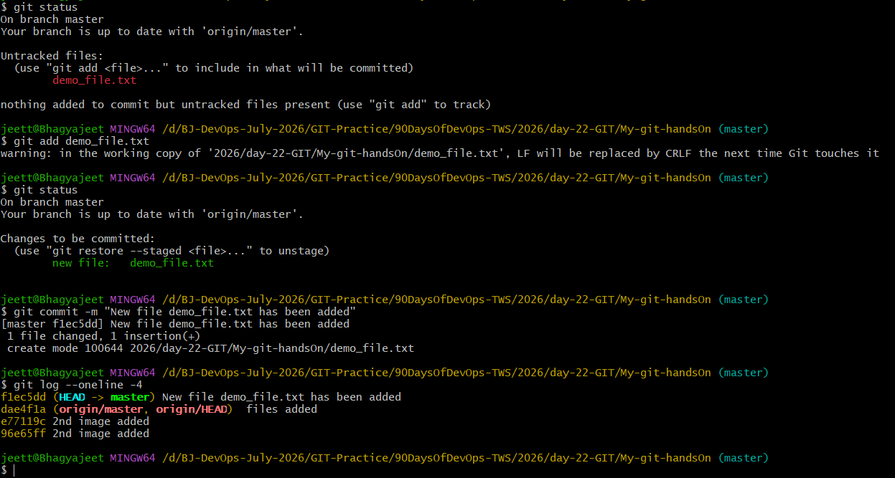
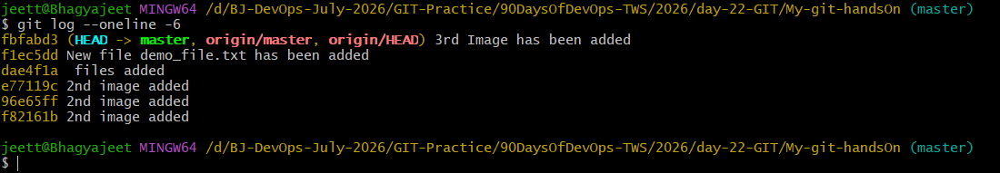

## Challenge Tasks

### Task 1: Install and Configure Git
1. Verify Git is installed on your machine
2. Set up your Git identity — name and email
3. Verify your configuration



---

### Task 2: Create Your Git Project
1. Create a new folder called `devops-git-practice`
2. Initialize it as a Git repository
3. Check the status — read and understand what Git is telling you
4. Explore the hidden `.git/` directory — look at what's inside



---

### Task 3: Create Your Git Commands Reference
1. Create a file called `git-commands.md` inside the repo
2. Add the Git commands you've used so far, organized by category:
   - **Setup & Config**
   - **Basic Workflow**
   - **Viewing Changes**
3. For each command, write:
   - What it does (1git config --global user.email "you@example.com"
Sets your email for commits.

# Git Commands

## Setup & Config

### git init
- Initializes a new Git repository.
- **Example**:
```bash
git init
```

### git config

* Configures Git username or email.
* **Example**:

```bash
git config --global user.name "Your Name"
git config --global user.email "Your Email"
```

* View Config Values
* **Example**:

```bash
git config --global --list
```

---

## Basic Workflow

### git add

* Stages changes for commit.
* **Example**:

```bash
git add file.txt
```

### git commit

* Saves staged changes with a commit message.
* **Example**:

```bash
git commit -m "Initial commit"
```

### git push

* Uploads local commits to the remote repository.
* **Example**:

```bash
git push origin main
```

### git pull

* Fetches and merges changes from the remote repository.
* **Example**:

```bash
git pull origin main
```

---

## Viewing Changes

### git status

* Shows the working directory status.
* **Example**:

```bash
git status
```

### git log

* Displays commit history.
* **Example**:

```bash
git log
```

### git log --oneline --graph --decorate

* Shows compact commit history with branch graph.
* **Example**:

```bash
git log --oneline --graph --decorate
```

### git diff

* Shows changes between commits or working directory.
* **Example**:

```bash
git diff
```

```

---------------------


## Task 3: Create Your Git Commands Reference

Here is a concise Git commands reference to help you quickly recall essential commands:

### Setup & Configuration
- `git init`: Initialize a new Git repository.
- `git config --global user.name "Your Name"`: Set your Git username.
- `git config --global user.email "Your Email"`: Set your Git email.
- `git config --global --list`: View all global Git configurations.

### Basic Workflow
- `git add <file>`: Stage changes for commit.
- `git commit -m "message"`: Commit staged changes with a message.
- `git push origin <branch>`: Push commits to remote branch.
- `git pull origin <branch>`: Fetch and merge changes from remote.

### Branching
- `git branch`: List all branches.
- `git branch <branch>`: Create a new branch.
- `git checkout <branch>`: Switch to a branch.
- `git checkout -b <branch>`: Create and switch to a new branch.
- `git merge <branch>`: Merge a branch into the current branch.

### Viewing Changes
- `git status`: Show working directory status.
- `git log`: Show commit history.
- `git log --oneline --graph --decorate`: Show compact commit history with graph.
- `git diff`: Show changes between commits or working directory.

### Undo & Stash
- `git reset --hard`: Discard all local changes.
- `git stash`: Temporarily save changes.
- `git stash pop`: Apply stashed changes and remove stash.

This reference covers the most common Git commands you’ll use daily. Keep it handy for quick lookup!

```


### Task 4: Stage and Commit
1. Stage your file
2. Check what's staged
3. Commit with a meaningful message
4. View your commit history




---

### Task 5: Make More Changes and Build History
1. Edit `git-commands.md` — add more commands as you discover them
2. Check what changed since your last commit
3. Stage and commit again with a different, descriptive message
4. Repeat this process at least **3 times** so you have multiple commits in your history
5. View the full history in a compact format



---

### Task 6: Understand the Git Workflow
Answer these questions in your own words (add them to a `day-22-notes.md` file):

# Task 6: Understand the Git Workflow

## 1. Difference between `git add` and `git commit`
- **git add**: Moves files from the untracked area to the staging area, preparing them for commit.  
- **git commit**: Moves files from the staging area into the repository history. Once committed, files are tracked and can be recovered if deleted.

---

## 2. What does the staging area do? Why doesn't Git just commit directly?
- The **staging area** is a checkpoint where files are reviewed before committing.  
- It allows you to decide exactly what will be committed and prevents accidental or unwanted commits.  
- Git requires manual commits to give developers control over changes.

---

## 3. What information does `git log` show you?
- Displays commit history with details such as:
  - Commit IDs (unique cryptographic hashes)  
  - Author name and email  
  - Date and time of commit  
  - Commit messages  
  - Branch details  
- Helps track activities and compare local vs. remote repository states.

---

## 4. What is the `.git/` folder and what happens if you delete it?
- The `.git/` folder contains all metadata and history of the repository.  
- It monitors file creation, modification, deletion, and restoration.  
- **If deleted**, Git will stop tracking changes, and the repository will lose its version control capabilities.

---

## 5. Difference between Working Directory, Staging Area, and Repository
- **Working Directory**: Where all changes are made (editing, adding, deleting files).  
- **Staging Area**: Temporary holding area for files before committing.  
- **Repository**: Permanent storage where committed files are tracked and versioned, allowing recovery if needed.


---
